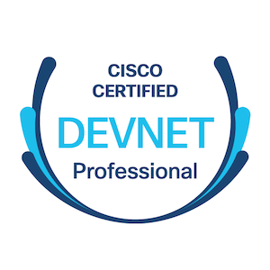
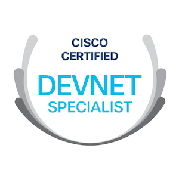

In this post I’m going to describe the DevNet Pro certification, what it is, how to prepare, and some thoughts on the whole experience.

As of early 2021, there are only two levels of certification in the DevNet ecosystem: Associate and Professional. The DevNet Associate requires one exam, DEVASC. I’ve written previously on the DevNet Associate in two articles on this site. The DevNet Professional requires one core exam candidates must pass and eight specialist exams. Any one of the specialist exams can be passed by a candidate along with the core to become qualified as a DevNet Pro. The flexibility offered in this program is remarkable. After taking three of the exams, I’m confident in the program’s relevance to engineers who are interested in building and automating IT solutions.

In 2020, I passed the DEVCOR and ENAUTO exams to complete the Cisco DevNet Pro certification. I sat and passed DEVCOR in September and ENAUTO in November. Passing DEVCOR and any of the eight specialist exams qualifies a candidate to be certified a DevNet Professional. I’m not going to sugarcoat this; these exams are tough. If you’re studying for either of these exams, you will be well served by developing your own projects, code, and practical examples. Not only will this help you pass the exams, but it’ll also give you a great base of knowledge to build automation solutions in practice.

## My Exam Preparation Process

When I prepare for an IT exam, I organize the body of knowledge I’m expected to know and work through it systematically. Most of the time, I take topics in order of appearance in the certification program’s materials. I study each topic with this process:

1) Review for awareness and basic understanding with beginner friendly resources.
2) Review again to dive deeper into all available resources for an in-depth understanding and in-depth practical applications.
3) Connect to related topics and create practical scenarios to gain in-depth understanding.

After that process I consider a topic completed and I move onto other topics. If my study schedule is longer than three months or so, I’ll review previous topics weekly or biweekly to keep my understanding fresh. That’s it!

## DEVCOR Preparation

To prepare for the DEVCOR exam I went through a course called Developing Applications Using Cisco Core Platforms and APIs (DEVCOR) v1.0 on the Cisco Digital Learning Library. This course was excellent at covering most of the exam topics in good detail. There’s about forty hours of content in this course, and I suggest reviewing all of it. I also watched CBTNuggets’ DEVCOR video course to gain a general understanding of a topic before reviewing the more in-depth Cisco course. I didn’t watch every video in the CBTNuggets course, but I watched enough to get a sense of the quality and care the course developers put into it. There’s nineteen hours of video instruction in the course. It's most useful for beginning your study of topics foreign to you.

After working my way through some of the CBTNuggets videos and diving deeper with the Cisco course, I also created my own practical examples. I wrote code and created anything that would take my understanding to the next level. A common practical exercise is to write a toy SDK for an API you are experimenting with. I did this with the APIs for DNA Center, Firepower Device Manager, Intersight, and UCS Manager. Going through this process, even at a small scale, for various APIs provides a rich learning experience and lessons you won’t forget soon.

It’s important to realize the topic categories on this exam are weighted at 20% each. This means each category on the exam will have a decent amount of depth. The topic list in each category is relatively short and uses verbs to describe what’s expected of an exam candidate. To ensure complete coverage for the exam, it’s important to not move too quickly through the topics unless you have in-depth practical experience already. If you take your time and understand the fundamentals, you’ll be thankful during the exam.

## DEVCOR Exam

Between 2010 and 2015, I suffered many poor exam experiences that negatively colored my perception of IT certifications. In the last few years, I’ve taken the CISSP exam and three DevNet exams. All four of these experiences were much better than my earlier experiences. My DEVCOR exam experience was as good as any other I’ve had. I took the exam at home using Pearson Vue’s OnVue app and I didn’t have any technical difficulty. The exam is fair in its content and clearly focused on assessing a candidate’s fundamental knowledge of the topics. The experience was similar to the DevNet Associate exam in its form but differed in expectation of depth. It’s very clear the expectations of a DEVCOR candidate are much higher than that of DEVASC. Prepare thoroughly!

## ENAUTO Preparation

For the ENAUTO exam I followed a similar study pattern as for DEVCOR: I reviewed the ENAUTO Cisco Digital Learning Library course, watched a number of the CBTNuggets ENAUTO videos, and built practical examples. This exam is very focused on network automation. Network device automation, DNA Center, SD-WAN, and Meraki make up 80% of this exam. Spend your study time on as many practical examples using these APIs and tools as you can. If you’re a network engineer, this is fast becoming your bread and butter day-to-day. Everything you spend your time on in this exam is likely relevant to your day job or will be soon. Keep calm and automate.

## ENAUTO Exam

This exam was a bit different than the previous. Most of the questions in the exam were grounded in the fundamentals of the topics and didn’t frustrate. However, I remember feeling annoyed at some of the questions as they seemed like trivia. I won’t go into specifics, but I’ll say that this exam has room for minor improvement. I’m encouraged to know there are lot of people writing and reviewing new questions constantly. I’m hopeful all questions on the exam will be high quality in the future.

As with DEVCOR, I took this exam at home using OnVue. I experience no technical difficulties. I have come to prefer remotely administered exams over a testing center. I like being in the comfort of my own home and I accept the trade-off of Pearson Vue installing monitoring software on my computer. I always revoke permissions and uninstall OnVue after I’ve completed an exam, just in case they get owned.

Beyond the few occurrences of trivia, this exam is much more focused than the core exam. That’s obvious to anyone looking at the exam topics but it didn’t really hit me until I was reading question during the live exam just how focused it was. Specialist certifications are for specialists!

## Final Thoughts

The DevNet Pro is a relevant and flexible certification that shows employers and peers you take automation seriously. I’m pleased by the flexibility of a single common core exam and eight specialization exams. This format provides every candidate a solid foundation and space to dive into their chosen specialty. And if you want to add more specialties, they’re just one exam away. The key takeaways for preparing for these these exams is to take a structured approach, use solid study resources, and practice in the lab. Read and write code. There’s no substitute for practical hands-on experience. I hope this is helpful to you and I wish you good luck in your preparation and exams.

## Notes & References

More DevNet certification information  
<https://developer.cisco.com/certification/>

DEVASC is officially called DevNet Associate Exam v1.0 (DEVASC 200-901).

DEVCOR and ENAUTO are officially called Developing Applications using Cisco Core Platforms and APIs v1.0 (350-901) and Automating and Programming Cisco Enterprise Solutions v1.0 (300-435), respectively.

 DEVASC Articles  
<https://sambyers.net/devnet-asc/>  
<https://sambyers.net/devnet-asc-part-2/>

DEVCOR Exam Topics  
<https://learningnetwork.cisco.com/s/devcor-exam-topics>

ENAUTO Exam Topics  
<https://learningnetwork.cisco.com/s/enauto-exam-topics>

Cisco Digital Learning Library  
<https://digital-learning.cisco.com>

Cisco Digital Learning Library DEVCOR course  
<https://digital-learning.cisco.com/#/course/61908>

Cisco Digital Learning Library ENAUTO course  
<https://digital-learning.cisco.com/#/course/61955>

CBTNuggets DEVCOR course  
<https://www.cbtnuggets.com/it-training/cisco/cisco-certified-devnet-professional-devcor-350-901>

CBTNuggets ENAUTO course  
<https://www.cbtnuggets.com/it-training/cisco/enterprise-automating-solutions>

DEVCOR Practical Examples Repo  
<https://github.com/sambyers/devnet_learning>

ENAUTO Practical Examples Repo  
<https://github.com/sambyers/netauto_learning>
